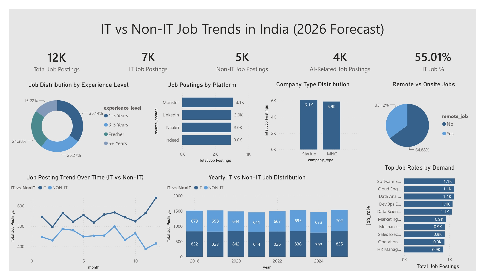

# 📊 IT vs Non-IT Job Trends in India (2026 Forecast)

A comprehensive **Power BI dashboard** that analyzes and compares IT and Non-IT job market trends in India. The dashboard provides insights into job postings, experience-level demand, hiring platforms, company types, remote work trends, and projected employment patterns to support data-driven career and recruitment decisions.

---

## 📷 Dashboard Preview

---

# 📌 Project Overview

The **IT vs Non-IT Job Trends in India (2026 Forecast)** dashboard delivers an analytical view of India's evolving employment landscape. It compares hiring demand between IT and Non-IT sectors while highlighting key recruitment trends across industries, platforms, experience levels, and job roles.

This dashboard is designed for:

- Students exploring career opportunities
- Job seekers planning career transitions
- HR professionals
- Recruiters
- Business analysts
- Workforce planning teams

---

# 🎯 Business Problem

With rapid digital transformation, understanding hiring trends across industries has become increasingly important. Organizations and professionals need reliable insights to answer questions such as:

- Which sector offers more employment opportunities?
- Which experience levels are most in demand?
- Which hiring platforms generate the highest number of job postings?
- Are remote jobs becoming more common?
- Which job roles have the highest hiring demand?
- How are IT and Non-IT job markets evolving over time?

This dashboard consolidates these insights into an interactive and easy-to-understand report.

---

# 📂 Dataset

The dataset includes information such as:

- Job Category (IT / Non-IT)
- Job Role
- Experience Level
- Company Type
- Hiring Platform
- Remote/Onsite Status
- Job Posting Date
- Year
- AI-related Job Indicator

---

# 📈 Dashboard KPIs

| KPI | Value |
|------|--------|
| Total Job Postings | 12K |
| IT Job Postings | 7K |
| Non-IT Job Postings | 5K |
| AI-Related Job Postings | 4K |
| IT Job Share | 55.01% |

---

# 📊 Dashboard Features

## 1. Job Distribution by Experience Level

Displays hiring demand across:

- Fresher
- 1–3 Years
- 3–5 Years
- 5+ Years

**Purpose**

- Understand which experience levels receive the highest recruitment demand.

---

## 2. Job Postings by Platform

Compares hiring activity across major recruitment platforms:

- Monster
- LinkedIn
- Naukri
- Indeed

**Purpose**

- Identify the most active job portals for recruitment.

---

## 3. Company Type Distribution

Shows job postings across:

- Startups
- MNCs

**Purpose**

- Compare hiring opportunities between startups and multinational companies.

---

## 4. Remote vs Onsite Jobs

Analyzes the distribution of:

- Remote Jobs
- Onsite Jobs

**Purpose**

- Understand current workplace flexibility trends.

---

## 5. Job Posting Trend Over Time (IT vs Non-IT)

Line chart comparing monthly hiring trends between IT and Non-IT sectors.

**Purpose**

- Analyze seasonal hiring patterns and market fluctuations.

---

## 6. Yearly IT vs Non-IT Job Distribution

Stacked column chart comparing yearly job postings across both sectors.

**Purpose**

- Track long-term employment growth and market evolution.

---

## 7. Top Job Roles by Demand

Highlights the most in-demand job roles, including:

- Software Engineer
- Cloud Engineer
- Data Analyst
- DevOps Engineer
- Data Scientist
- Marketing Executive
- Mechanical Engineer
- Sales Executive
- Operations Executive
- HR Manager

**Purpose**

- Identify high-demand career opportunities across industries.

---

# 🛠 Tools Used

- Microsoft Power BI
- Power Query
- DAX
- Microsoft Excel
- Data Modeling

---

# 📌 Key Insights

- Over **12,000** job postings were analyzed.
- IT jobs account for **55.01%** of total job opportunities.
- Approximately **4,000** AI-related jobs indicate strong demand for AI skills.
- Startup hiring slightly exceeds MNC hiring.
- Onsite roles remain more common than remote opportunities.
- Software Engineering, Cloud Engineering, Data Analytics, and Data Science are among the most in-demand IT roles.
- Hiring demand shows consistent growth in the IT sector compared to Non-IT.

---

# 💼 Business Value

This dashboard helps:

- Job seekers identify high-demand career paths.
- Students understand future employment trends.
- Recruiters benchmark hiring activity.
- HR teams optimize workforce planning.
- Organizations analyze industry hiring patterns.
- Decision-makers forecast employment demand.

---

# 🚀 Future Enhancements

- Live job data integration using APIs
- Salary trend analysis
- State-wise hiring analysis
- Industry-wise recruitment comparison
- AI-powered job demand forecasting
- Interactive job recommendation system

---

# 📚 Skills Demonstrated

- Data Cleaning
- Data Modeling
- Power Query
- DAX Measures
- KPI Development
- Dashboard Design
- Data Visualization
- Business Intelligence
- Trend Analysis
- Workforce Analytics

---

# 👨‍💻 Author

**Yashwanth Katuru**

Aspiring Data Analyst | Power BI Developer

### Technical Skills

- Power BI
- SQL
- Excel
- Python
- Data Analytics
- Data Visualization
- Dashboard Development
